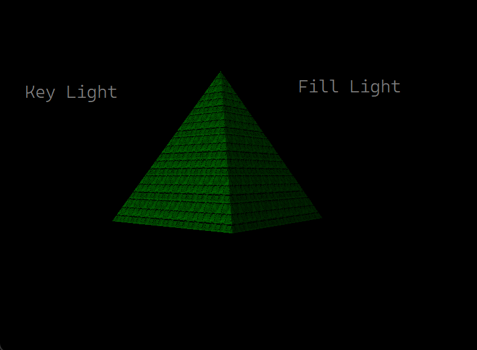

# OpenGL-Lighting-Demo

A demonstration of how to implement lighting in modern OpenGL.

The following code utilizes a textured pyramid shape to demonstrate
the use of lighting in OpenGL. A key light is rendered at 100% intensity 
with a green tint followed by a fill light on the opposite side at 10% to 
demonstrate how shadows can be cast when normals are mapped to a mesh and
passed into the object's shader. 

